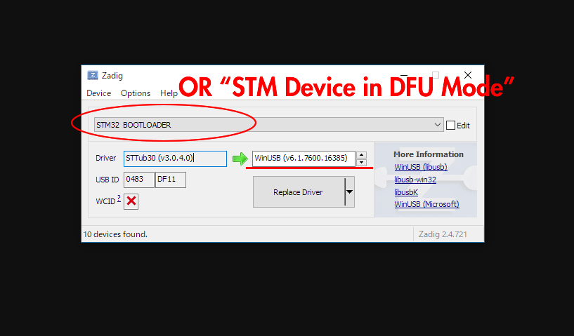

# STM32マイコンのUSB-DFUブートローダへの入り方
STM32マイコンを使用したキーボードのファームウェアを書き込む際にはあらかじめキーボードをブートローダモードにしておく必要があります。   
以下のどちらかの方法でブートローダへ入りファームウェアの書き換えが可能になります。
1. QMK Firmwareの```RESET```キーコードが割り振られたキースイッチを押す
2. 基板上のタクトスイッチを使う
    1. Resetスイッチを押す
    2. Bootスイッチを押す
    3. Resetスイッチを離す
    4. Bootスイッチを離す

#### (windowsの場合)ドライバを入れ替える
Zadigを使用してOS標準で入るドライバをWinUSBのものに入れ替える必要があります。
1. zadigをダウンロード、解凍する。(https://zadig.akeo.ie/)
2. キーボードをbootloaderモードでPCに接続する   
(この段階では```STM Device in DFU Mode```として認識されているはず)
3. zadigを起動して```Options → List All devices```にチェック
4. ```STM Device in DFU Mode```もしくは```STM32 BOOTLOADER```を選択して、```WinUSB```をインストールする   
**書き換えるデバイス名を必ず確認してから```Replace Driver```を押して下さい。**   
**間違えたデバイスのドライバを書き換えると最悪PCが操作不能になります**


5. 再度キーボードをbootloaderモードでPCに接続。   
(```STM32 BOOTLOADER```として認識されていればOK)