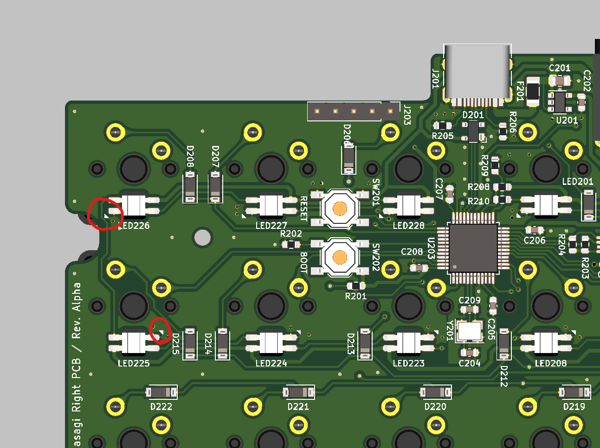
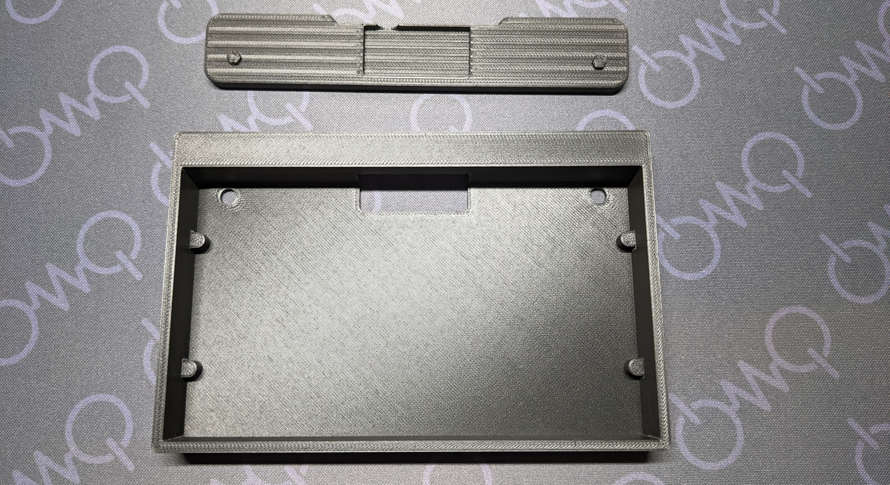
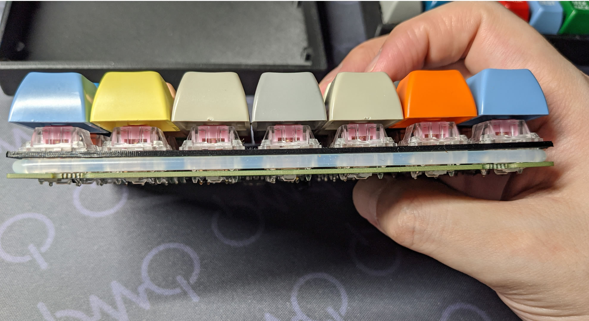
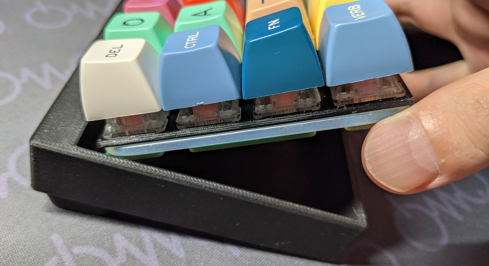

Casasagi Oリングマウントケースキット
====================================

お買い上げありがとうございます。      
組立前に必ずこちらのビルドガイドを確認して下さい。   
部品の不足やご質問などがありましたら、urkwtky@gmail.com、または[Twitter(@hsgw)](https://twitter.com/hsgw)までご連絡下さい。

## 付属品
|            | 数量   |
| ---------- | ---: |
| ケース        | 左右各1 |
| プレート       | 2    |
| casasagi基板 | 左右各1 |
| Oリング       | 2    |
| ゴム足        | 8    |

## その他に必要なもの
- Cherry MX互換スイッチ * 56
- キーキャップ
- USB TYPE-C ケーブル
- 3.5mm TRS(3極)ケーブル
- (実装するなら) SK6812MINI-E * 56

## 動作確認
## 組み立て前の動作確認
[default](https://github.com/hsgw/qmk_firmware/tree/casasagi/keyboards/casasagi/keymaps/default)ファームウェアが書き込まれています。   
USBケーブルを接続してlainキーボードとして認識されるかどうか確認して下さい。　　　
キーボードとして認識されたら、スイッチソケットのパッドを適当なジャンパー線などでショートさせて文字が入力されるかどうか確認します。   

## LEDについて(オプション)
シリアルRGB LED(SK6812MINI-E)に対応したパッドがあります。   
方向が行ごとに互い違いになっています。向きに気をつけて実装して下さい。

また、デフォルトのファームウェアではLEDは点灯しません。他のキーマップを参考にして下さい。

## スイッチのはんだづけ
プレートを通して基板にスイッチをはんだづけします。   
プレートは左右ともに同形状で裏表はありません。   
奥までまっすぐしっかりと差し込めているかどうか確認をお忘れなく。

## 動作確認
スイッチが全て正しく動作するか、PCと接続して確認します。

## ケースについて

ケースはPLAフィラメントでプリントされています。   
基板を取り外しやすいように足部分は固定されていませんが、アクリサンデーなどのアクリル用接着剤などで接着することも出来ます。

## ケースへの組付け
1. Oリングをプレートと基板の間に挟みます

2. 傾けて奥からケースへ差し込みます

1. 2の段階でゆるすぎるならOリングとスイッチの間に厚紙やプラスチック辺などを挟み込むと安定します

## ファームウェア
こちらのリポジトリにあります
https://github.com/hsgw/qmk_firmware/tree/casasagi
https://github.com/hsgw/qmk_firmware/tree/casasagi/keyboards/casasagi

## ブートローダへの入り方
ファームウェアを書き換える場合は、予めキーボードをブートローダモードにする必要があります。   
また、windowsの場合はドライバーが必要です。   
詳しくは以下を参照して下さい。

[STM32マイコンのUSB-DFUブートローダへの入り方](../STM32_bootloader.md)