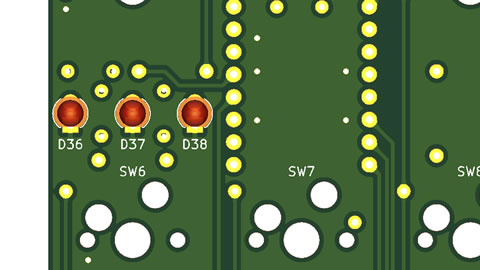

JIS Split TKL ビルドガイド
=======================

お買い上げありがとうございます。      
組立前に必ずこちらのビルドガイドを確認して下さい。   
部品の不足やご質問などがありましたら、urkwtky@gmail.com、または[Twitter(@hsgw)](https://twitter.com/hsgw)までご連絡下さい。

## キーレイアウト


## キットに含まれるもの

| 種類               | 値     | 個数 |
|--------------------|--------|------|
| LED                | 3mm 青 | 3    |
| 抵抗               | 10k    | 5    |
| ダイオード         |        | 90   |
| SWソケット         | MX用   | 90   |
| タクタイルスイッチ |        | 2    |
| TRRSコネクタ       |        | 2    |
| ゴム足             |       | 8    |
| M2x10mm スペーサ   |        | 16   |
| M1.7x10mm スペーサ |        | 4    |
| M2x5mmネジ         |        | 32   |
| M1.7x5mmネジ       | 8      | 8    |

## 他に必要なもの

| 種類               | 値           | 個数 |
|--------------------|--------------|------|
| スイッチ           |  CherryMX互換 | 90   |
| 2Uスタビライザー   |              | 2    |
| Pro micro          | コンスルー付 | 2    |
| キーキャップセット | 日本語配列   |      |

## 必要なキーキャップについて
一般的な日本語配列用キーキャップに加えて、2.25Uキーキャップが2個必要です
2.25Uキーキャップ例
https://talpkeyboard.stores.jp/items/5e2d1d65cf327f287ef2d785

## 組み立て
### 抵抗のはんだづけ
10kΩ抵抗をはんだづけします   
裏側から差し込んで表面(スイッチ側)ではんだづけします

***左側基板のR4は実装済みです***   
左側はLED付近に3つ、右側はPro Micro付近に1つあります

(左基板)


(右基板)


### ダイオードのはんだづけ
ダイオードをはんだづけします   
抵抗と同じく裏側から差し込んで表面(スイッチ側)ではんだづけします

***ダイオードには極性(向き)があります***   
マーキングがある方向とダイオードの帯を揃えてはんだづけして下さい


### スイッチソケットのはんだづけ
スイッチソケットをはんだづけします   
パッドとソケットのどちらもしっかり温めてはんだが流れていることを確認しながら実装して下さい

### LEDのはんだづけ
LEDをはんだづけします   
LEDはスイッチ面から差し込んで下さい



***LEDはスイッチ側から差し込んで実装します！！！***   
片方の足だけをはんだづけして、真っ直ぐかつ奥までしっかり差し込めているか確認してからもう片方をはんだ付けして下さい。

***LEDには極性があります！！！！！***     
LEDの足の長い方(アノード)が基板の丸いパッド側に実装します。

### リセットスイッチとTRRSコネクタのはんだづけ
リセットスイッチとTRRSコネクタをはんだづけします   
裏面から差し込んで表面ではんだづけします

### Pro Micro
Pro Microは部品のある面が外側になるようにコンスルーをはんだづけしたあと裏面から差し込みます


### 動作確認
Pro Microを差し込んだら、ファームウェアを書き込んで動作確認をします   
ファームウェアはこちらのリポジトリに入っています

https://github.com/hsgw/qmk_firmware/tree/dm9_split/
https://github.com/hsgw/qmk_firmware/tree/dm9_split/keyboards/dm9records/jis_split_tkl

ビルドコマンドは
```
make dm9records/jis_split_tkl:default
(同時に書き込むなら)
make dm9records/jis_split_tkl:default:flash
```

ファームウェアが書き込めたら、キーボードとして認識されるかどうか、スイッチソケットの両端をピンセットなどでショートさせて正しく入力されるかを確認して下さい

### スイッチとスイッチプレートの取り付け
スイッチプレートにはめ込みながらメイン基板にスイッチを取り付けていきます   
スイッチの足が真っ直ぐでないとソケットに入らず曲がってしまうので取り付ける前に確認して真っ直ぐに整えながら差し込んで下さい

### 動作確認
スイッチを押して正しく動作するか確認します
入力されないキーがある場合はソケットが正しくはんだづけされているか、スイッチの足が曲がっていないか確認して下さい

### ボトムプレートの取り付け
ボトムプレートへスペーサをネジ止めします   
全てのスペーサがボトムプレートへ固定されたあとメイン基板+スイッチプレートを重ねて上からネジ止めします
