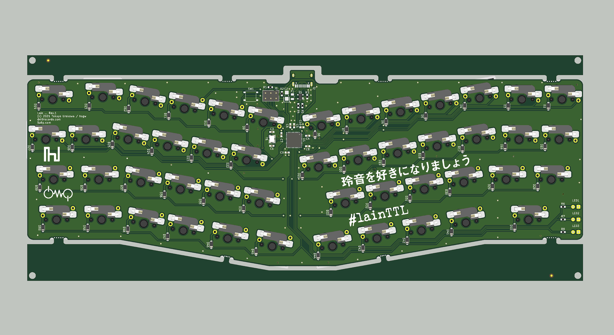
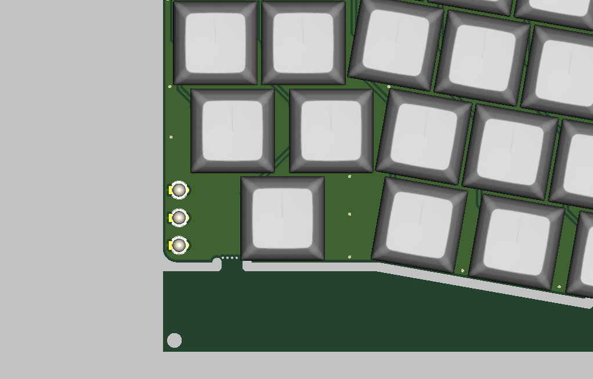
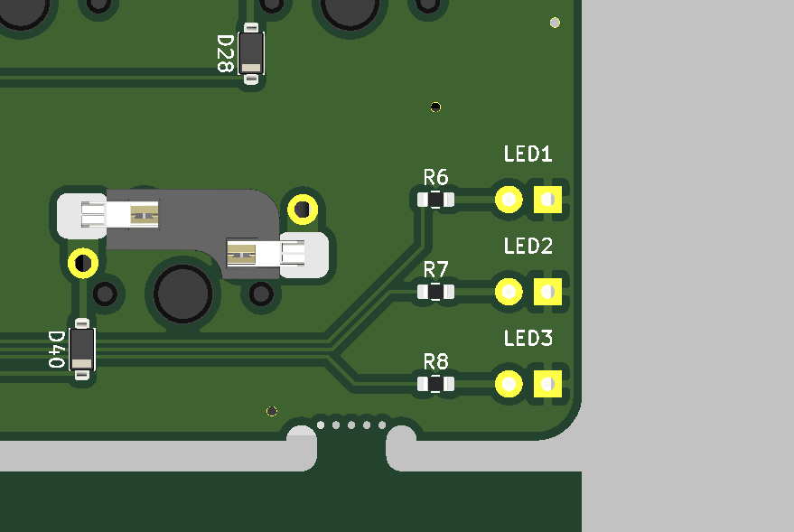
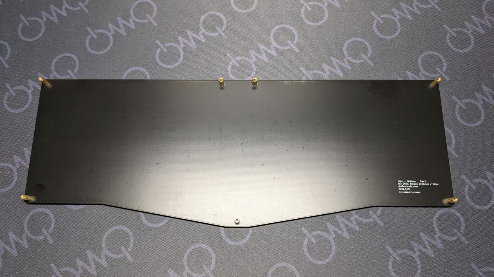
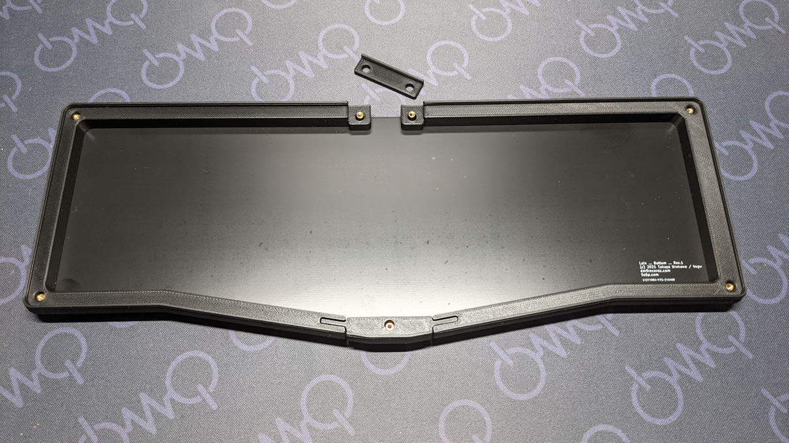
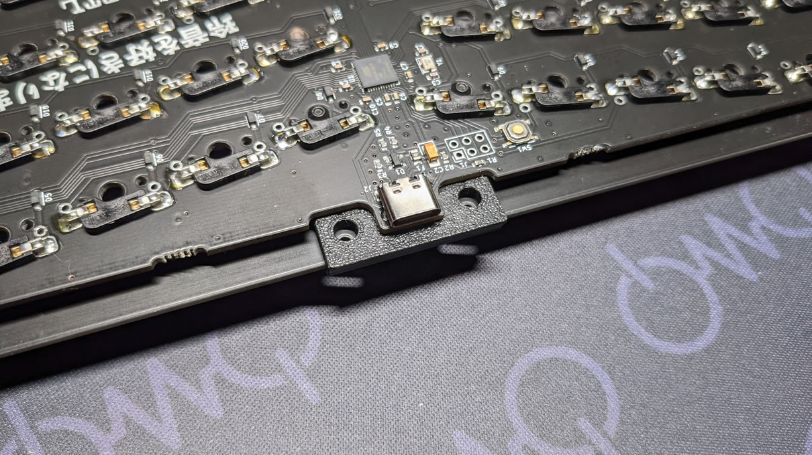

Lain(Rev.1/3D print case) ビルドガイド
=======================

お買い上げありがとうございます。      
組立前に必ずこちらのビルドガイドを確認して下さい。   
部品の不足やご質問などがありましたら、urkwtky@gmail.com、または[Twitter(@hsgw)](https://twitter.com/hsgw)までご連絡下さい。

## 付属品
|              | 数量   |
| ------------ | ---: |
| LED          | 3    |
| スイッチソケット     | 49   |
| メイン基板        | 1    |
| スイッチプレート     | 1    |
| ボトムプレート      | 1    |
| M2x4mm ネジ    | 14   |
| M2x7mmスペーサ   | 7    |
| ゴム足          | 4    |
| 3Dプリントミドルパーツセット | 1 |

## その他に必要なもの
- Cherry MX互換スイッチ * 49
- USB TYPE-C ケーブル

## 組み立て前の動作確認
[default](https://github.com/hsgw/qmk_firmware/tree/lain/keyboards/dm9records/lain/keymaps/default)ファームウェアが書き込まれています。   
USBケーブルを接続してlainキーボードとして認識されるかどうか確認して下さい。　　　
キーボードとして認識されたら、スイッチソケットのパッドを適当なジャンパー線などでショートさせて文字が入力されるかどうか確認します。

## スイッチソケットのはんだづけ

スイッチソケットをはんだづけします。

## LEDのはんだづけ




LEDをはんだづけします。

***LEDはスイッチ側から差し込んで実装します！！！***   
片方の足だけをはんだづけして、真っ直ぐかつ奥までしっかり差し込めているか確認してからもう片方をはんだ付けして下さい。

***LEDには極性があります！！！！！***     
LEDの足の長い方(アノード)が基板の丸いパッド側に実装します。


## スイッチのとりつけ
スイッチプレートをはさみながらスイッチをソケットに差し込んでいきます。   
スイッチの足が曲がっているとソケットにうまく入らず曲がってしまうことがあります。　　　
差し込む前に足を真っ直ぐに整えて下さい。   

## 動作確認
USBケーブルを差し込んでスイッチが動作するかどうかもう一度確認して下さい。   

## ケースの組付け
1. ボトムプレートにスペーサを取り付けます。
2. ミドルパーツをスペーサに差し込みます。
3. 一番小さいパーツをスイッチプレートと基板の間に挟みます。
4. ボトムプレートとスイッチプレートをネジ止めします。

## ファームウェアについて
ファームウェアはこちらのリポジトリにあります。   
https://github.com/hsgw/qmk_firmware/tree/lain

### ファームウェアのビルドコマンド
```sh
make dm9records/lain/rev1:default
```